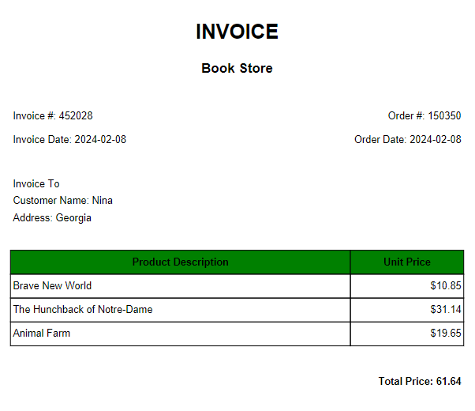

<div style="text-align:center;"> <h1> Book Shop Application </h1> </div> 

----------
Video Demo: https://www.youtube.com/

----------
**Welcome to the Book Shop Application!**
 This Python program allows users to browse through various book categories, select books to purchase, and proceed to checkout. 
 
 The application uses data saved to an Excel file `books.xlsx` from [Goodreads books collections](https://www.goodreads.com/list?ref=nav_brws_lists).


## Description and Features:

### Features
- Browse through multiple book categories.
- View a list of books in each category.
- Add books to the shopping cart.
- Remove books from the shopping cart.
- View the shopping cart and total price.
- Checkout and generate an invoice PDF.

`The main function` serves as the entry point of the program. It starts by displaying a greeting message and initializing some variables. It then enters a while loop that allows users to navigate through the different categories and perform various actions such as choosing a book to buy, navigating between pages, and checking out.

**Category Selection**:  ["Books You Must Read Before You Die"](https://www.goodreads.com/list/show/952.1001_Books_You_Must_Read_Before_You_Die), ["Science Fiction & Fantasy"](https://www.goodreads.com/list/show/2700.Science_Fiction_and_Fantasy_Must_Reads), ["History Books,"](https://www.goodreads.com/list/show/1362.Best_History_Books_), ["Memoir/Biography/Autobiography"](https://www.goodreads.com/list/show/281.Best_Memoir_Biography_Autobiography), ["Motivational and Self-Improvement Books"](https://www.goodreads.com/list/show/7616.Motivational_and_Self_Improvement_Books).

`The load_books function` loads the book data from the Excel file and returns it as a list of lists and uses the tabulate library to display the book data in a grid format.

**Browsing Books**: Within each category, users can navigate through multiple pages of books and view details such as title, author, and price(*the prices are randomly generated*).

```
+-----+---------------------------------------------------------------------------------------------+------------------------------+----------+--------+   
|   N | 📝 Title                                                                                     | 🤓 Author                     | 💲Price   | None   |
+=====+=============================================================================================+==============================+==========+========+   
|   1 | To Kill a Mockingbird                                                                       | Harper Lee                   | 35.89$   |        |   
+-----+---------------------------------------------------------------------------------------------+------------------------------+----------+--------+   
|   2 | Pride and Prejudice                                                                         | Jane Austen                  | 11.33$   |        |   
```

`The buy_book function` serves to add selected book to the cart

**Shopping Cart**: Users can review the item(s) added and proceed to checkout.

`The checkout function` displays the options available to the user such as checking out, adding more books to the cart, removing undesired ones or canceling the checkout process.

**Checkout**: At checkout, users can confirm payment, enter their personal information to an invoice for their purchase.

`The create_invoice function` collects customer information, and generates an invoice PDF file.


<div style="text-align:center;">  </div>


----------
----------


### Installation and usage:
1. Clone this repository to your local machine:
```
git clone [https://github.com/ninaniel/](https://github.com/ninaniel/Book-Store-for-cs50p-final)
```

2. Install the required dependencies:
```
pip install -r requirements.txt
```

3. Run the main.py file to start the application:
```
python main.py
```

4. Follow the on-screen prompts to browse books, add them to your cart, and proceed to checkout.
----------
### Dependencies:
`openpyxl`: For reading and writing Excel files to store book data.

`tabulate`: For formatting book data into a tabular structure.

`fpdf`: For generating PDF invoices.
